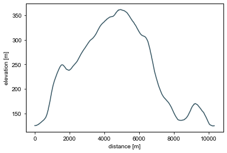
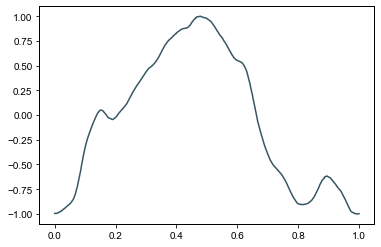
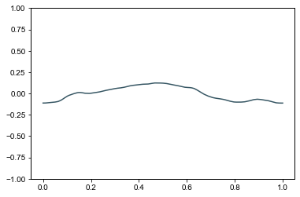
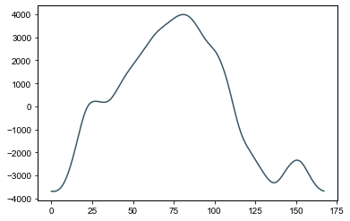
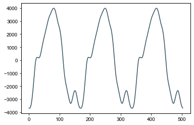

Tutorial
========

.. code:: python

    import komoog.komoot as komoot
    import komoog.audio as audio
    import matplotlib.pyplot as pl

Download komoot tours
---------------------

.. code:: python

    tours = komoot.download_all_komoot_tours()

.. code:: python

    for i, tour in enumerate(tours):
        print(i, tour['name'])

.. parsed-literal::

    0 Colorado Provencale in Rustrel – La Doa Loop from Rustrel
    1 Lookout – L´Aiguebrun Loop from Buoux
    2 Gorges de Régalon – Vue de la Gorge Loop from Quartier Gardet
    3 Forêt des Cèdres - Vue au sud – Belvédère Loop from Lacoste
    4 Crête du Grand luberon – Le Mourre Nègre (1125m) Loop from Rue de l'Église
    5 Beautiful Cliffs – Gorges d'Oppedette Loop from D 201
    6 Beautiful Cliffs – Gorges d'Oppedette Loop from D 201
    7 Chateau des Eveques Loop from Fontaine-de-Vaucluse
    8 Valescure vaucluse Loop from Fontaine-de-Vaucluse
    9 Colorado Provencale in Rustrel – Aussicht auf die Sahara Loop from Rustrel
    10 Chateau des Eveques – Belle vue Loop from Fontaine-de-Vaucluse
    11 Porte de Saignon – Ortskern Saignon Loop from Apt
    12 Ortskern Saignon – Porte de Saignon Loop from Apt
    13 Möllensee und Kiessee

Load komoot tours from harddrive
--------------------------------

Tours are saved in ``~/.komoog/``.

.. code:: python

    import komoog.io as io
    tours = io.read_tours()

Plot elevation profile
----------------------

.. code:: python

    import komoog.gpx as gpx
    
    gpx_tracks = gpx.convert_tour_to_gpx_tracks(tours[2])
    distance, elevation = gpx.convert_gpx_tracks_to_arrays(gpx_tracks)
    
    pl.plot(distance, elevation)
    pl.xlabel('distance [m]')
    pl.ylabel('elevation [m]')

Convert elevation profile to signal
-----------------------------------

This will normalize the profile to the correct ranges and remove
duplicates

.. code:: python

    x, y = audio.convert_distance_and_elevation_to_signal(distance, elevation)
    
    pl.plot(x,y )

By default, signals will be maximized. If you don’t want them maximized,
define a maximum elevation difference that will correspond to the range
[-1,1] instead, e.g. 2000 meters.

.. code:: python

    x, y = audio.convert_distance_and_elevation_to_signal(distance,
                                                          elevation,
                                                          max_elevation_difference=2000)
    
    pl.plot(x,y)
    pl.ylim(-1,1)

Convert signal to audio
-----------------------

.. code:: python

    # approximate_length_in_seconds = 0 will give a single loop of the signal
    audio_data, sampling_rate = audio.convert_signal_to_audio(x,
                                                         y,
                                                         approximate_length_in_seconds=0
                                                        )
    pl.plot(audio_data)

Loop wave
---------

.. code:: python

    audio_data, sampling_rate = audio.convert_signal_to_audio(
                                                         x,
                                                         y,
                                                         approximate_length_in_seconds=1/100
                                                        )
    pl.plot(audio_data)

Generate longer audio data and play it
--------------------------------------

.. code:: python

    audio_data, sampling_rate = audio.convert_signal_to_audio(x,y,)
    audio.play_audio(audio_data, sampling_rate)

You should’ve heard a sound now. Note that by default, a sound length of
1s is produced.

Tune to different notes
-----------------------

.. code:: python

    audio_data, sampling_rate = audio.convert_signal_to_audio(
                                                         x,
                                                         y,
                                                         tune='A'
                                                        )
    audio.play_audio(audio_data, sampling_rate)

These are the tunes that work:

.. code:: python

    audio._NOTES

.. parsed-literal::

    {'C': -9,
     'C#': -8,
     'Db': -8,
     'D': -7,
     'D#': -6,
     'Eb': -6,
     'E': -5,
     'F': -4,
     'F#': -3,
     'Gb': -3,
     'G': -2,
     'G#': -1,
     'Ab': -1,
     'A': 0,
     'A#': 1,
     'Bb': 1,
     'B': 2}

You can also tune to a specific frequency, e.g. 200 Hz.

.. code:: python

    audio_data, sampling_rate = audio.convert_signal_to_audio(
                                                         x,
                                                         y,
                                                         tune=220,
                                                        )
    audio.play_audio(audio_data, sampling_rate)

Change sampling rate
--------------------

.. code:: python

    audio_data, sampling_rate = audio.convert_signal_to_audio(
                                                         x,
                                                         y,
                                                         sampling_rate=48000,
                                                        )
    audio.play_audio(audio_data, sampling_rate)

Write .wav file
---------------

.. code:: python

    io.write_wav('./example.wav',audio_data,sampling_rate)

Converting tours to sound without going through all the hassle
--------------------------------------------------------------

.. code:: python

    audio_data, sampling_rate = audio.convert_tour_to_audio(
                                         tours[2],
                                         max_elevation_difference=1000,
                                         sampling_rate=48000,
                                         tune='A',
                                         approximate_length_in_seconds=3,
                                        )
    audio.play_audio(audio_data, sampling_rate)

Make the frequency of the sound follow the elevation profile
------------------------------------------------------------

.. code:: python

    audio_data, sampling_rate = audio.convert_tour_to_audio(
                                         tours[2],
                                         max_elevation_difference=1000,
                                         sampling_rate=48000,
                                         tune='A#',
                                         approximate_length_in_seconds=3,
                                         set_tune_to_follow_tour_profile=True,
                                        )
    audio.play_audio(audio_data, sampling_rate)

Interactive conversion without downloading all tours previously
---------------------------------------------------------------

.. code:: python

    tour = komoot.choose_komoot_tour_live()
    
    audio_data, sampling_rate = audio.convert_tour_to_audio(tour)
    audio.play_audio(audio_data, sampling_rate)
